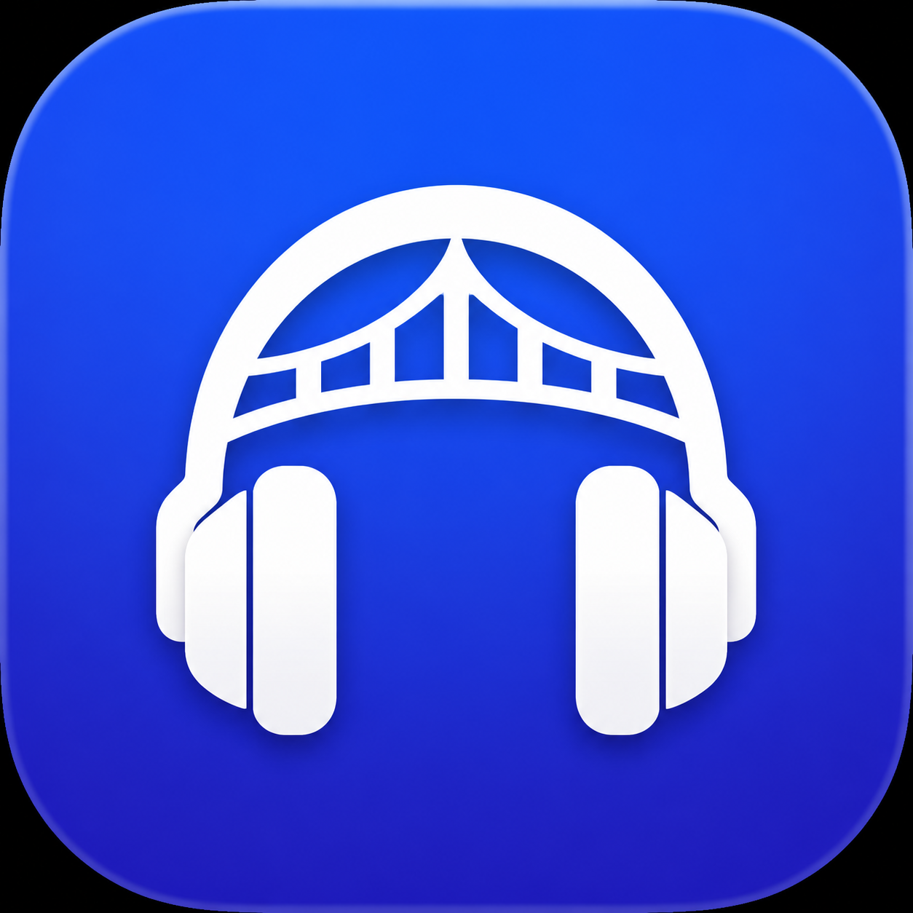
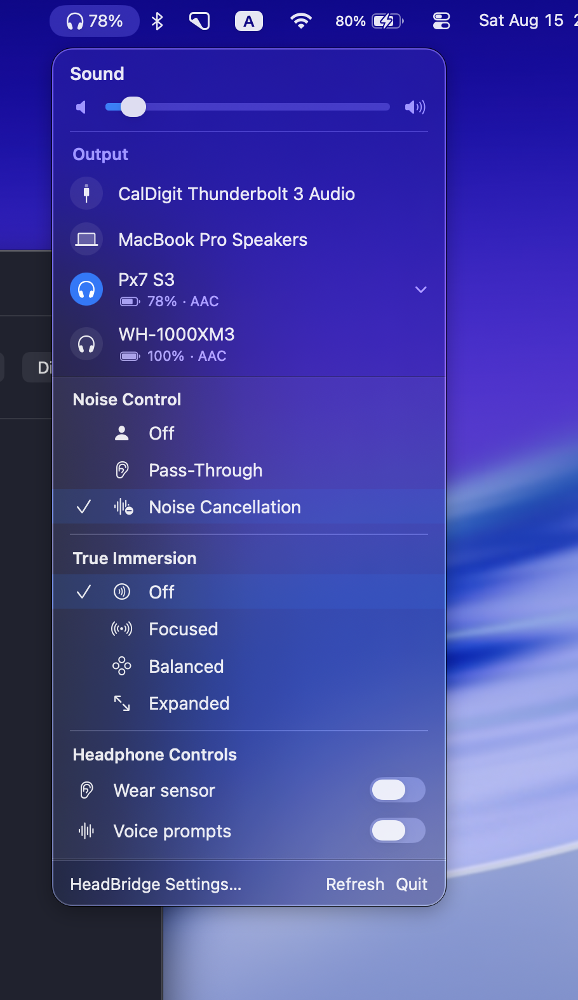
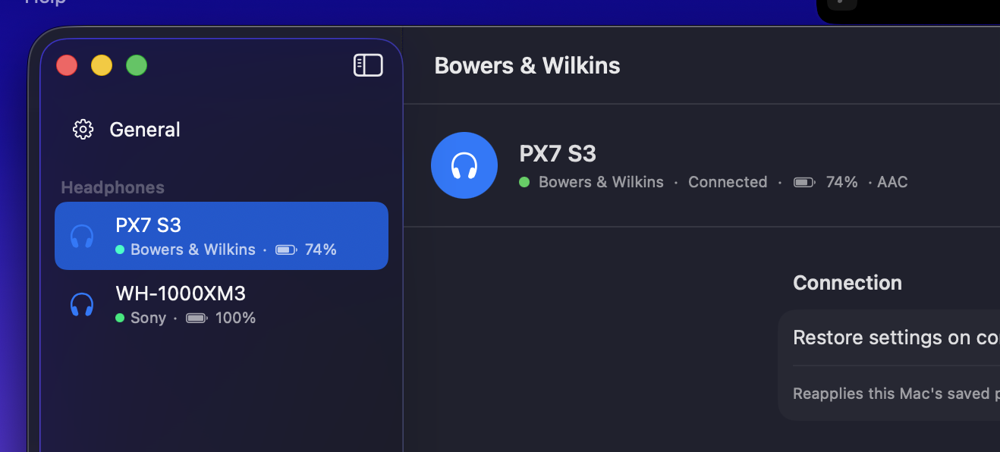

# HeadBridge

<p align="center">
  
</p>

HeadBridge brings AirPods-style system controls to third-party Bluetooth headphones on macOS. It is a native menu-bar app with independently implemented providers for recent Bowers & Wilkins RPC devices and Sony MDR V1 headphones.

[](https://github.com/herenickname/HeadBridge/actions/workflows/ci.yml)
[](https://github.com/herenickname/HeadBridge/releases/latest)
[](LICENSE)

> [!WARNING]
> HeadBridge is an early beta. Hardware validation currently covers Bowers & Wilkins Px7 S3 and Sony WH-1000XM3. Recognition of another model is not a guarantee that every control is compatible. Public builds are not signed with an Apple Developer ID and are not notarized; read [Unsigned builds and security](#unsigned-builds-and-security) before installing.

<p align="center">
  
  
</p>

## Install

HeadBridge requires macOS 14 or newer. The optional Control Center extension requires macOS 26.

Install the latest release directly into `/Applications`:

```shell
curl -fsSL https://raw.githubusercontent.com/herenickname/HeadBridge/main/Scripts/install.sh | bash
```

The command downloads and executes this repository's [`install.sh`](Scripts/install.sh). Because HeadBridge is not notarized, the installer removes Apple's quarantine attribute from the installed `HeadBridge.app` only. That bypasses Gatekeeper for this app. If you do not want to run a remote script unseen, inspect it first:

```shell
curl -fsSL https://raw.githubusercontent.com/herenickname/HeadBridge/main/Scripts/install.sh \
  -o /tmp/headbridge-install.sh
less /tmp/headbridge-install.sh
bash /tmp/headbridge-install.sh
```

### Manual installation

1. Download the app archive from the [latest GitHub Release](https://github.com/herenickname/HeadBridge/releases/latest).
2. Extract it and move `HeadBridge.app` to `/Applications`.
3. Review the source and release workflow to the degree appropriate for your threat model.
4. If macOS blocks the app because it is from an unidentified developer, remove quarantine from this bundle explicitly:

   ```shell
   sudo xattr -dr com.apple.quarantine /Applications/HeadBridge.app
   open /Applications/HeadBridge.app
   ```

5. Allow Bluetooth access and connect the headphones as a macOS audio output.

HeadBridge has no Dock icon. Open its headphones icon in the menu bar, then choose **HeadBridge Settings…** for the full settings window.

### Updating

Use **HeadBridge Settings… → Check for Updates…** for in-app updates, or run the install command again. Sparkle verifies update archives using the public key embedded in the app; this update signature is separate from Apple Developer ID signing and notarization.

## Compatibility

| Provider family | Hardware validation | Status |
| --- | --- | --- |
| Bowers & Wilkins RPC | Px7 S3, firmware `3.17.4.17` | Validated |
| Recent PX/PI models exposing the same RPC service | Not yet tested | Experimental and capability-probed |
| Sony MDR V1 | WH-1000XM3 | Validated on hardware |
| Other Sony MDR V1 models | Not yet tested | Experimental common controls |
| Sony MDR V2 / Link2 | Service generation is detected | Not supported yet |

Firmware updates can change behavior. Please include the exact model, firmware, macOS version, and working/broken controls in a [device-support report](.github/ISSUE_TEMPLATE/device_support.yml).

## Add support for your headphones

The maintainer physically owns and tests only a Bowers & Wilkins Px7 S3 and a
Sony WH-1000XM3. I can review code for another model, but I cannot honestly
claim that it works without somebody testing it on that exact hardware.

If you want HeadBridge to support another device, the fastest path is:

1. Fork or clone this repository.
2. Open the checkout in Codex or Claude Code and select the latest capable
   coding model available to you.
3. Ask it to read [`CONTRIBUTING.md`](CONTRIBUTING.md) and
   [`docs/PROVIDERS.md`](docs/PROVIDERS.md), then adapt the closest provider or
   add a new one. Give it the exact model, firmware, and observations from your
   headphones; do not let it guess unknown protocol behavior.
4. Build HeadBridge and exercise every exposed control on the real device,
   including disconnect/reconnect and restore-on-connect.
5. Run the repository checks and open a GitHub Pull Request with the hardware
   results. A device-support issue by itself cannot make an untested model
   validated.

AI assistance is welcome, but the Pull Request author is responsible for
reviewing the resulting code and confirming its behavior on hardware. See the
[contributor workflow](CONTRIBUTING.md#ai-assisted-device-workflow) for the
full checklist.

## Features

### macOS integration

- Output selection and immediately observed Core Audio volume.
- Input devices on `Option`-click.
- Sticky Input, which restores a user-selected microphone if macOS switches it after a headset connects.
- Active-headphone battery in the menu bar: never, only below 20%, or always.
- Per-headset 24-hour, 7-day, and 30-day battery charts. While connected, one lightweight sample is stored every five minutes and retained locally for 90 days.
- Optional Launch at Login and cryptographically verified Sparkle updates from GitHub Releases.
- Per-provider restore-on-connect profiles that reapply settings after another source, such as a phone, changes them.
- macOS 26 Control Center controls for active-headphone noise mode and Sticky Input.
- No continuous vendor scan while a matching Bluetooth audio output is absent.

### Bowers & Wilkins RPC

The provider targets a protocol family rather than one model. Device capabilities and command replies determine which controls are shown. Px7 S3 validation currently covers:

- ANC, pass-through, and off;
- five-band EQ and bypass;
- battery, charging state, source, codec, and sample rate;
- wear sensor, sensitivity, standby timer, quick-action button, voice prompts, and local name;
- True Immersion modes;
- optional advanced RPC values/log diagnostics, disabled by default.

Destructive operations such as factory reset, pairing-list mutation, firmware update, and DFU are intentionally not exposed.

See the independent [Bowers & Wilkins RPC wire notes](docs/BowersWilkinsRPC.md)
for transport discovery, message framing, capability probing, and contributor
safety boundaries.

### Sony MDR V1

The pure-Swift V1 stack uses `IOBluetooth` RFCOMM, incremental framing, an ACK/retry queue, and model capability profiles. WH-1000XM3 validation currently covers:

- noise cancellation, ambient sound, wind reduction, off, and ambient level where applicable;
- all WH-1000XM3 EQ presets and six manual bands, including Clear Bass;
- Surround (VPT), sound position, DSEE HX, and touch-sensor control;
- NC optimizer state and atmospheric-pressure readback;
- automatic power-off and sound-quality/stable-connection modes;
- battery, codec, and independent headset volume;
- optional one-way macOS → headphones volume synchronization (`0...30`).

See the independent [Sony MDR V1 wire notes](docs/SonyMDRV1.md) and [V2 adapter notes](docs/SonyMDRV2.md).

## Known limitations

- Only the two models listed as validated above have been tested on hardware.
- Sony MDR V2/Link2 is recognized but not implemented.
- Sony volume synchronization currently flows from macOS to the headphones, not in both directions.
- Changing Sony sound-quality mode reconnects Bluetooth audio.
- The macOS Control Center extension requires macOS 26; the menu-bar app supports macOS 14 and newer.
- A provider currently owns one active control session for its protocol family. Simultaneously controlling two headphones from the same family is not yet supported.
- Common battery, connection, and noise controls flow through `HeadphoneProvider`; richer vendor controls still require a small UI registration in HeadBridge.

## Privacy

HeadBridge has no account, analytics, telemetry, or cloud sync. Headphone control happens locally over Bluetooth. Battery history includes a stable local device identifier and is stored for 90 days in `~/Library/Application Support/HeadBridge/BatteryHistory.plist`; it can be cleared from each device's settings.

Sparkle contacts GitHub Releases when update checks are enabled. Advanced diagnostic views remain local unless the user exports their contents. See [PRIVACY.md](PRIVACY.md) for details.

## Unsigned builds and security

Current public builds are ad-hoc signed for bundle integrity, but they are **not** signed with an Apple Developer ID and are **not notarized by Apple**. macOS therefore quarantines a downloaded build and may refuse to launch it until quarantine is removed.

The installer does not make the build Apple-trusted. It downloads the latest GitHub Release, installs `HeadBridge.app` into `/Applications`, and removes quarantine from that exact bundle so macOS can launch it. Piping a network response into a shell and bypassing Gatekeeper both carry risk. The script, release workflow, source, and build instructions are public so you can inspect or build HeadBridge yourself instead.

HeadBridge needs Bluetooth permission to open vendor control channels. It has no account, analytics, advertising SDK, or cloud sync. Update checks are the only routine network access; device control and battery history remain local. Security issues should be reported according to [SECURITY.md](SECURITY.md).

## Build from source

Requirements: macOS 14+ and Xcode 26 for the Control Center extension.

```shell
swift test
HEADBRIDGE_SKIP_REGISTRATION=1 ./Scripts/build-app.sh
open "dist/HeadBridge.app"
```

Omit `HEADBRIDGE_SKIP_REGISTRATION=1` when you want the local build script to register the Control Center extension. Generated products live under `.build/` and `dist/`.

The build scripts always use an ad-hoc signature and never search for or use an Apple Development or Developer ID identity from your Keychain.

## Architecture and contributing

Every integration conforms to `HeadphoneProvider`: it matches Core Audio devices, owns its vendor transport, publishes runtime capabilities, and implements only the commands the connected device supports. Model-specific behavior belongs in capability profiles or protocol-generation adapters, not in provider names.

Common UI is provider-driven and unknown providers receive a generic settings screen. A provider with richer controls adds its provider-owned settings/menu view through a small registration step. See [CONTRIBUTING.md](CONTRIBUTING.md) and [docs/PROVIDERS.md](docs/PROVIDERS.md) before opening a pull request.

Protocol contributions must be clean-room: document independently observed wire facts and captures, but do not copy vendor or third-party source code, assets, or decompiled implementation. Research credits are in [THIRD_PARTY_NOTICES.md](THIRD_PARTY_NOTICES.md).

## Updates and releases

Sparkle 2 is exact-pinned through Swift Package Manager. Tagged releases are built by GitHub Actions, published to GitHub Releases, and accompanied by a signed Sparkle appcast for automatic updates. The application itself remains ad-hoc signed and unnotarized; the release workflow does not use an Apple signing identity.

See [docs/RELEASING.md](docs/RELEASING.md) and the [release checklist](docs/RELEASE_CHECKLIST.md) for the maintainer flow.

## License

HeadBridge is available under the [MIT License](LICENSE). Third-party notices, including the Sparkle license shipped with binary distributions, are listed in [THIRD_PARTY_NOTICES.md](THIRD_PARTY_NOTICES.md).
